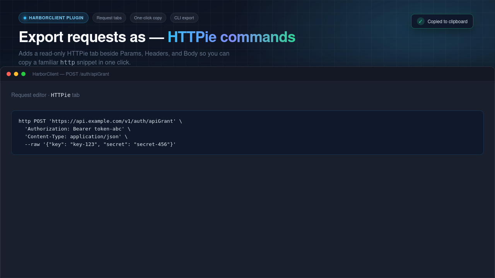

# HarborClient HTTPie Plugin

Adds an **HTTPie** tab to the request editor that shows an equivalent `http` command for the configured request. The command is editable — change it and click **Update** (or blur the editor) to apply the parsed request back to the active tab. A **Copy** button copies the current editor text.



## Install

Build the plugin, then install the `.hcp` package or load the project folder unpacked:

```bash
pnpm install
pnpm build
```

In HarborClient: **Settings → Plugins → Load unpacked…** and select this directory.

Requires HarborClient with `hc.host.applyRequestDraft` support (SDK `@harborclient/sdk` ≥ 1.1.31).

## Development

```bash
pnpm dev
```

Rebuilds `dist/renderer.js` on change when HarborClient file watching is enabled for unpacked plugins.

## Bidirectional editing

1. Open a request and switch to the **HTTPie** tab to see the generated command.
2. Edit the command in the editor (method, URL, headers, body flags).
3. Click **Update**, or leave the editor (blur), to parse the command and replace the active request’s method, URL, headers, and body.
4. Click **Copy** to copy the current editor contents.

The editor resyncs when you edit the request in other tabs (Params, Headers, Body, etc.). Blur only applies when the text differs from the generated command.

## Limitations

| Aspect            | Behavior                                                                  |
| ----------------- | ------------------------------------------------------------------------- |
| Variables         | Resolved from collection + active environment (environment wins on dupes) |
| Cookie jar        | Not included unless a `Cookie` header is set manually                     |
| Pre/post scripts  | Do not affect displayed HTTPie; Update does not modify scripts            |
| Multipart files   | Uses stored file paths (`field@/path`) on the local machine               |
| Auth tab          | Generated Authorization headers round-trip as headers, not Auth tab mode  |
| Unsupported flags | Common HTTPie noise flags are ignored; unknown flags skip                 |

## License

MIT
